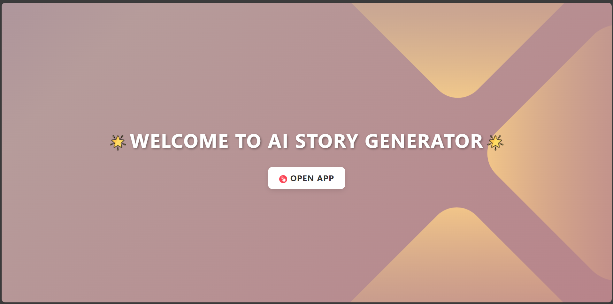
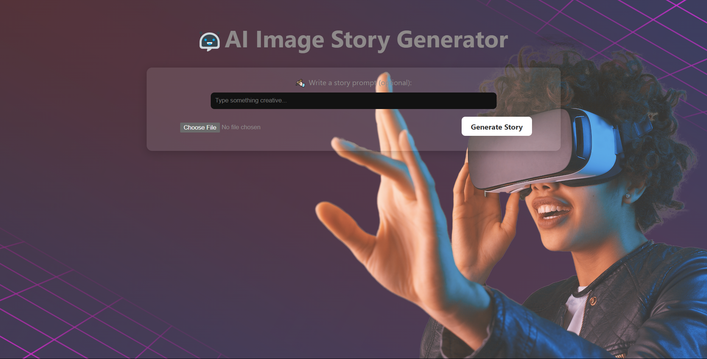
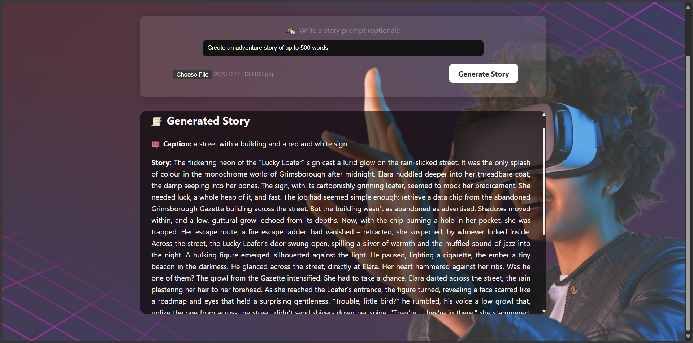

# 🖼️ AI Image Story Generator

Turn any image into a beautiful short story using AI. This app leverages **Image Captioning (CLIP or BLIP)** and **Gemini AI** to generate unique and creative stories from images and optional prompts.

---

## 🚀 Features

- 🔍 **Image Captioning** with HuggingFace models (BLIP or CLIP)
- 🤖 **Story Generation** using Gemini API
- 📝 Optional prompt for personalized storylines
- 🎨 Clean and responsive React frontend
- 🧠 Flask-based Python backend

---

## 🧱 Project Structure & Overview


---

### 📂 File-by-File Breakdown

#### 🔧 `backend/`
| File | Description |
|------|-------------|
| `app.py` | Flask server defining the `/upload` route to handle file uploads and return a story. |
| `image_captioning.py` | Uses a pretrained HuggingFace model (BLIP/CLIP) to generate a caption for the uploaded image. |
| `story_generator.py` | Sends the caption (and optional prompt) to Gemini API and retrieves a short story. |
| `credential.ini` | Stores your Gemini API key securely (excluded from version control). |
| `requirements.txt` | Lists Python packages like `Flask`, `transformers`, `Pillow`, etc. |
| `uploads/` | Temporary folder to save uploaded images before processing. |

---

#### 🧑‍🎨 `frontend/`
| File | Description |
|------|-------------|
| `App.jsx` | The main React component that renders the upload form and story display area. |
| `UploadImage.jsx` | Handles image upload, optional prompt input, and API call to Flask backend. |
| `StoryDisplay.jsx` | Displays the image caption and the generated story in a stylized box. |
| `main.jsx` | React entry point that mounts `<App />` to the DOM. |
| `index.css` | Base styles like font, layout, padding. |
| `styles.css` | App-level styles including gradients, centered layout, transitions, etc. |
| `package.json` | Contains metadata and scripts for building/running the React app. |
| `public/` | Optional static assets like icons or logos. |

---


---

## ⚙️ Setup Instructions

### 🔹 Backend

1. **Navigate to the backend folder**:
    ```bash
    cd backend
    ```

2. **Create virtual environment (optional but recommended)**:
    ```bash
    python -m venv venv
    source venv/bin/activate  # or venv\Scripts\activate on Windows
    ```

3. **Install dependencies**:
    ```bash
    pip install -r requirements.txt
    ```

4. **Add your Gemini API key** in a file called `credential.ini`:
    ```ini
    [gemini]
    api_key=your_gemini_api_key
    ```

5. **Run Flask server**:
    ```bash
    python app.py
    ```

---

### 🔹 Frontend

1. **Navigate to the frontend folder**:
    ```bash
    cd frontend
    ```

2. **Install dependencies**:
    ```bash
    npm install
    ```

3. **Run development server**:
    ```bash
    npm run dev
    ```

4. **Visit in browser**:
    ```
    http://localhost:5173/
    ```

---

## 📬 API Endpoint

**POST** `/upload`  
Uploads an image + optional prompt and returns caption + story.

### Request (FormData):
- `image` (file): The image to upload
- `prompt` (string, optional): Extra prompt to guide the story

### Response (JSON):
```json
{
  "caption": "a scenic view of a sunset",
  "story": "As the sun dipped below the hills, casting amber shadows..."
}

```
```
```
## 🖼️ App Screenshots

```
```
Here’s a quick look at how the app works:

### 🚀 Landing Page
Shows the welcome screen with an animated entry button.


### 🧠 Main Interface
Where users upload an image and optionally write a prompt.


### ✨ Story Generation Demo
Displays the generated story below the uploaded image.


```
```
## 🧠 Tech Stack
```
```
This project is built using modern web technologies and state-of-the-art AI models:

### 🖼️ Frontend
- **React** – Component-based UI library for building interactive user interfaces
- **Vite** – Fast, lightweight development server and build tool

### 🧪 Backend
- **Python** – Core backend language
- **Flask** – Lightweight web framework for building the API

### 🧠 Machine Learning Models
- **HuggingFace Transformers** – Pretrained image captioning models like:
  - `BLIP` (Bootstrapped Language Image Pretraining)
  - `CLIP` (Contrastive Language–Image Pretraining)

### 🤖 AI Story Generation
- **Gemini API (by Google)** – Advanced AI model used to generate creative short stories based on image captions and optional prompts

```
```
## 🪪 License
```
This project is licensed under the **MIT License** – you're free to use it for personal and commercial purposes.

```
